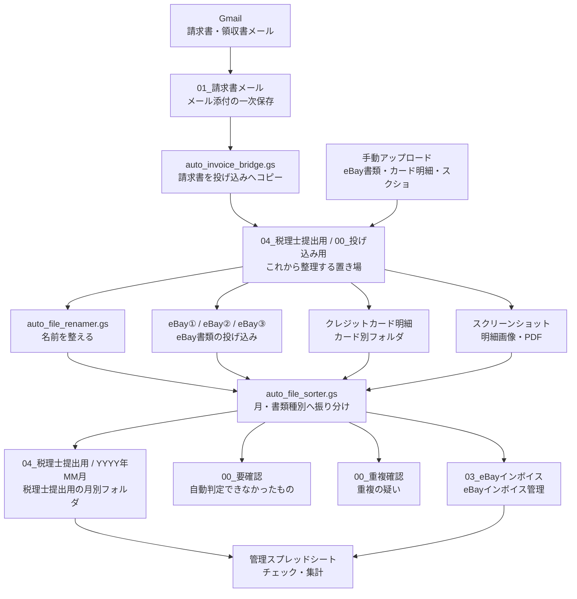

# eBay業務自動化 Phase1 フォルダ地図

作成日: 2026-05-26

## 結論

Phase1のGoogle Driveは、大きく分けて「いったん置く場所」「月別に整理された場所」「確認が必要な場所」の3種類で動いている。

現時点で一番大事なのは、`04_税理士提出用/00_要確認` に未分類ファイルが残っていること。ここは自動振り分けが判定できなかった書類の受け皿なので、今後の手動確認対象にする。

削除、移動、リネーム、GAS実行、トリガー変更は行っていない。

## 全体図

## フォルダ別の役割

| 場所 | 役割 | 今回見えた状態 |
|---|---|---|
| `01_請求書メール` | Gmailから拾った請求書・領収書添付の一次保存 | 年フォルダがある。`2026` と `2026年` のように表記違いのフォルダが混在 |
| `04_税理士提出用/00_投げ込み用` | これから自動整理するファイル置き場 | eBay、カード明細、スクショ、Amazon用のサブフォルダあり |
| `04_税理士提出用/YYYY年MM月` | 税理士提出用に月別・種類別で整理された最終置き場 | `2026年04月`、`2026年05月` などが直下に存在 |
| `04_税理士提出用/00_要確認` | 自動判定できなかったファイルの確認待ち置き場 | 見える範囲で50件。PDF、Excel、CSV、画像、ZIPが混在 |
| `04_税理士提出用/00_重複確認` | 重複疑いの確認場所 | 見える範囲では空 |
| `03_eBayインボイス` | eBayインボイス・取引レポート用 | 年フォルダ、月フォルダ、管理表あり。`2026年` は空に見える |
| `メルカード利用明細` | メルカード明細用 | 専用フォルダとして存在 |

## 投げ込み用フォルダの中身

`04_税理士提出用/00_投げ込み用` には、以下の入口がある。

| サブフォルダ | 入れるもの | 今回見えた状態 |
|---|---|---|
| `eBay①` | eBay書類の投げ込み | 見える範囲では空 |
| `eBay②` | eBay書類の投げ込み | 見える範囲では空 |
| `eBay③` | eBay書類の投げ込み | 見える範囲では空 |
| `クレジットカード明細` | カード明細 | カード別フォルダが9件 |
| `スクリーンショット` | JREバンク、メルカリ、メルカード等の画像/PDF | 用途別フォルダが4件 |
| `amazon` | Amazon関連 | 見える範囲では空 |

## 月別フォルダの中身

今回確認した範囲:

| 月別フォルダ | 見えたサブフォルダ |
|---|---|
| `2026年05月` | `カード明細`, `各種請求書`, `サブスク` |
| `2026年04月` | `カード明細`, `eBay売上`, `サブスク`, `外注請求書` |

## 振り分けルールの読み取り結果

| 処理 | 何を見るか | どこへ入れるか |
|---|---|---|
| 請求書メール保存 | Gmailの件名、送信元、添付ファイル | `01_請求書メール` の年フォルダ |
| 請求書ブリッジ | `01_請求書メール` に保存済みの添付 | `04_税理士提出用/00_投げ込み用` へコピー |
| 自動リネーム | ファイル内の金額や領収書取得状況との照合 | 名前を整えてから振り分けへ渡す |
| 自動振り分け | ファイル名、OCR月判定、マスターリストのキーワード | `04_税理士提出用/YYYY年MM月/書類種別` |
| eBay書類処理 | eBay①②③内のPDF/CSV、ファイル名、OCR判定 | 月別の `eBay売上` または `03_eBayインボイス` 系 |
| 領収書メール処理 | メール本文や添付の領収書 | 税理士提出用の月別フォルダ |
| スクショ/PDF抽出 | スクショやPDFのOCR | スプレッドシートと税理士提出用フォルダ |
| 判定不能 | 月や書類種別が決められないもの | `00_要確認` |
| 重複疑い | 同じファイル/同じ内容の可能性があるもの | `00_重複確認` |

## 間違い・迷子候補

今回の読み取りで見えた「すぐ消すもの」ではなく「確認した方がよいもの」。

| 優先 | 候補 | 理由 | 次アクション |
|---|---|---|---|
| 高 | `04_税理士提出用/00_要確認` の未分類ファイル | 見える範囲で50件。請求書、領収書、FedEx系、配送/通関系、CSV/Excel/画像/ZIPが混在 | 個別ファイルを開かず、まずカテゴリ別に再分類候補を作る |
| 高 | `01_請求書メール` の `2026` と `2026年` の混在 | `2026年` は空に見え、`2026` 側に実ファイルがある。自動保存先の表記がズレている可能性 | どちらを正にするか決める。削除や移動はまだしない |
| 中 | `04_税理士提出用` 直下の年フォルダと月フォルダの混在 | `2026年` / `2025年` は空に見え、実運用は `2026年05月` など月フォルダ直置きに見える | 「月フォルダ直置き」を正にするか確認 |
| 中 | `03_eBayインボイス` の `2026年` が空に見える | 月フォルダは直下にあり、年フォルダが使われていない可能性 | eBayインボイスも月フォルダ直置きでよいか確認 |
| 中 | `01_請求書メール/2026` にメール装飾画像が混ざる | DHL等のメールに付くバナー画像やボタン画像らしきものが保存されている | 保存対象から画像を除外するルールが必要か確認 |
| 低 | `04_税理士提出用` 直下の `請求書_投げ込み用` | 名前だけ見るとフォルダに見えるが、実体は小さなファイルに見える | 何の管理ファイルか確認。削除しない |

## 現時点で分かったこと

- `00_投げ込み用/eBay①②③` は空なので、eBay書類の未処理投げ込みは今は見えない。
- `00_重複確認` は空なので、重複疑いの滞留は今は見えない。
- `00_要確認` は空ではなく、実務上の未分類バックログが残っている。
- 年フォルダと月フォルダの設計が混ざっている。自動化側は「年フォルダ」ではなく「月フォルダ直置き」で動いている可能性がある。

## 次にやるとよいこと

1. `00_要確認` の50件は、`ebay-phase1-needs-review-triage.md` にファイル名ベースでカテゴリ分け済み。
2. 次は、移動予定リストをマスク済みで作る。
3. `01_請求書メール` の年フォルダ表記を、`2026` か `2026年` のどちらに統一するか決める。
4. メール装飾画像を保存対象から外すべきか判断する。
5. 自動振り分けを動かす前に、必ず「移動予定リストだけ出す」ドライランを作る。

## 禁止・未実施

- Google Drive内の削除、移動、リネームはしていない。
- GAS関数は実行していない。
- トリガー、Script Properties、GASコードは変更していない。
- PDFや画像の中身は開いていない。
- 個別の個人名・請求書番号・メールアドレスはこの文書に保存していない。
