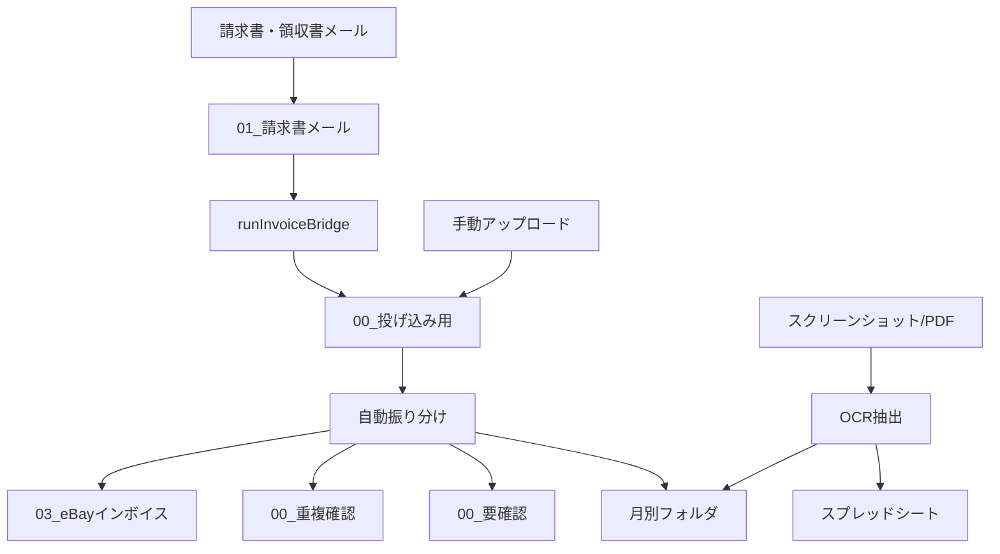

# eBay業務自動化 Phase1 安全運用手順

作成日: 2026-05-26

## 結論

Phase1は、いま動いているGASを急に直すより、まず「見る」「ドライランする」「記録する」を整える。

三神さんがGASエディタで関数名を探さなくても、毎日・毎月どこを見ればよいか分かる状態を作る。

削除、移動、リネーム、通知、トリガー変更、GAS削除は、必ず確認後に行う。

## 操作区分

| 区分 | 例 | 扱い |
|---|---|---|
| 見るだけ | 件数確認、フォルダ確認、ログ確認、状態確認 | 実行してよい |
| ドライラン | 移動予定、リネーム予定、通知予定を一覧化 | 実行してよい |
| 確認後に実行 | Drive移動、ファイル名変更、通知送信、シート大量書き込み | 三神さん確認後 |
| 直接実行しない | Drive削除、GAS削除、Script Properties変更、トリガー変更、行削除 | 原則禁止 |

## 毎日見るもの

| 見る場所 | 確認すること | 異常時 |
|---|---|---|
| トリガー実行履歴 | 失敗が出ていないか | エラー内容を記録して、再実行は確認後 |
| `01_請求書メール` | 請求書添付が保存されているか | 画像ノイズが多い場合は除外ルール候補へ |
| `04_税理士提出用/00_投げ込み用` | 未処理が溜まっていないか | 自動振り分け前にドライラン |
| `04_税理士提出用/00_要確認` | 未分類が増えていないか | 分類候補を作る。移動はしない |
| 実行ログ | いつ何が動いたか | ログ未整備ならログシート作成候補 |

## 毎月見るもの

| 目安 | 作業 | 見る場所 |
|---|---|---|
| 毎月7日 | eBay売上、円換算、税理士書類の一次確認 | eBay売上一覧、円換算、税理士提出用 |
| 毎月11日 | 外注費、請求書、領収書の確認 | 外注費一覧、請求書メール、月別フォルダ |
| 毎月15日 | 税理士提出チェック | 税理士提出チェックリスト |
| 月末 | 経営防御ダッシュボード確認 | 経営サマリー、月次利益 |

## 本番GASの安全ルール

| 対象 | ルール |
|---|---|
| 本番GAS 12ファイル | 削除しない。変更前にバックアップと目的を記録する |
| 不要候補4ファイル | 削除候補にするだけ。`runInvoiceBridge` は現役のため削除不可 |
| トリガー | 追加・削除・変更しない。まず一覧と実行履歴だけ見る |
| Script Properties | 値を読まない、保存しない。必要ならキー名だけ確認 |
| GAS関数 | 読み取り確認中は実行しない。テストはドライランから |

## 現役確認済みの注意点

| 項目 | 状態 | 判断 |
|---|---|---|
| `runInvoiceBridge` | 午前4時-5時のトリガーあり | 削除不可。請求書メールから投げ込み用へコピーする中継 |
| `collectTaxDocuments` | 関数選択リスト・トリガーでは未検出 | 旧設計名の可能性 |
| `collectEbayInvoices` | 関数選択リスト・トリガーでは未検出 | 旧設計名の可能性 |
| `screenshot_data_extractor.gs` | 存在確認済み | スクショ/PDFのOCR抽出用。実行前確認が必要 |
| Script Properties | 未確認 | 値露出リスクのためスキップ中 |

## フォルダ振り分けルール

基本ルール:

| 入り口 | 入るもの | 最終的に行く場所 |
|---|---|---|
| `01_請求書メール` | メール添付の請求書・領収書 | `00_投げ込み用` 経由で月別フォルダ |
| `00_投げ込み用/eBay①②③` | eBay書類 | eBay売上、eBayインボイス系 |
| `00_投げ込み用/クレジットカード明細` | カード明細 | 月別のカード明細、支出サブスク |
| `00_投げ込み用/スクリーンショット` | 画像・PDF明細 | OCR後にシートと月別フォルダ |
| `00_要確認` | 判定できなかったもの | 三神さん確認後に移動候補 |
| `00_重複確認` | 重複疑い | 確認後に残す/削除候補判断 |

## 迷子ファイルの扱い

`00_要確認` は、削除場所ではなく「判断待ち置き場」。

見えている分類:

| 分類 | 件数 | 次の扱い |
|---|---:|---|
| FedEx請求書 | 14 | 月別の請求書/送料系へ移動候補 |
| サブスク/サービス系 | 14 | 月別のサブスク/各種請求書へ移動候補 |
| 配送/通関/納品ラベル系 | 5 | 提出対象か確認 |
| CSV/Excel系 | 6 | 提出対象か確認 |
| 振込明細 | 3 | 月別の支払/振込明細系へ移動候補 |
| Refund/CreditNote | 1 | 返金/クレジットノートとして分ける候補 |
| 画像ノイズ候補 | 1 | 保存対象外候補。削除は確認後 |
| ZIP | 1 | 中身確認の許可後に判断 |
| その他 | 5 | 保留 |

次にやること:

1. 個別ファイルを開かず、番号付きの移動予定リストを作る。
2. 三神さんが分類ルールを確認する。
3. 移動する場合は、手動またはドライラン付きGASで行う。
4. 実移動前に、移動元・移動先・件数を再確認する。

## 実行ログシート仕様

| 実行日時 | 処理名 | 実行者 | 対象月 | モード | 対象件数 | 成功件数 | 失敗件数 | 状態 | エラー要約 | 次アクション |
|---|---|---|---|---|---:|---:|---:|---|---|---|

モード:

| モード | 意味 |
|---|---|
| `確認` | 状態を見るだけ |
| `ドライラン` | 予定一覧を出すだけ |
| `本番` | 実際に移動・書き込み・通知する |

## エラー時の手順

1. 同じ処理をすぐ連打しない。
2. 実行ログとトリガー履歴を見る。
3. どのファイル、どの月、どの件数で止まったかだけ記録する。
4. APIキー、トークン、メールアドレス、個人名、請求書番号は記録しない。
5. 必要なら三神さんに「再実行してよいか」を確認する。

## 改善の順番

1. 実行ログシートを作る。
2. スプレッドシートに `Phase1 管理` メニューを作る。
3. 「今日の状態」「月次チェック」「要確認」を見るだけで開けるようにする。
4. 移動・リネーム系は必ずドライランを先に出す。
5. Webダッシュボードは、シートメニューで不足すると分かってから作る。

## 未完了

- Script Propertiesのキー名確認。
- 実行ログシートが既にあるかの確認。
- スプレッドシート上の既存メニューの詳細確認。
- `00_要確認` のマスク済み移動予定リスト作成。
- テスト用サンプルでのドライラン設計。
