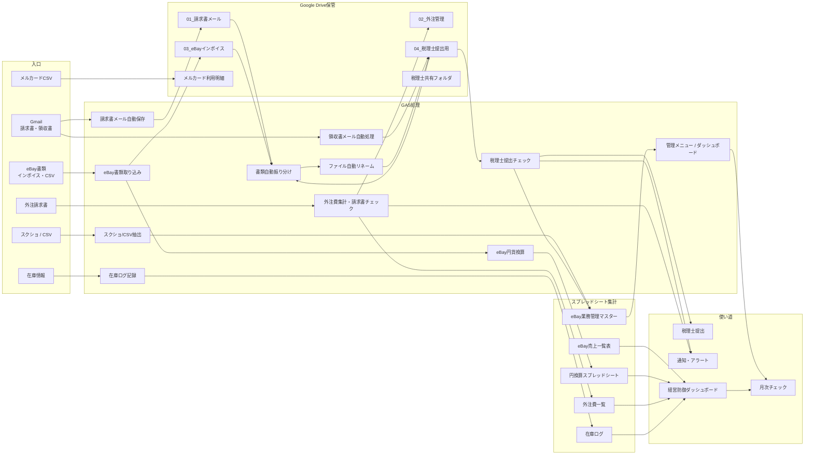
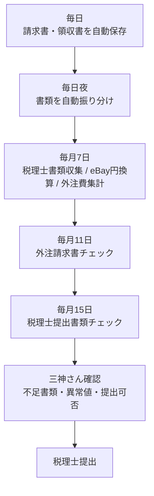

# eBay業務自動化 Phase1 システムマップ

最終更新: 2026-05-25

## 結論

Phase1は「メール・CSV・スクショ・各種書類」を入口にして、Google Driveへ保管し、スプレッドシートへ集計し、税理士提出・経営確認・在庫確認へつなぐ仕組み。

## 全体図

## 三神さん向けの読み方

- GmailやCSVが入口。
- GASが自動で保存・分類・集計する。
- Google Driveは書類保管場所。
- スプレッドシートは数字と進捗の確認場所。
- 最終的に「税理士へ出せるか」「月次で抜けがないか」「利益が守れているか」を見る。

## 機能別の流れ

| 入力 | GAS | 保存先 | 集計先 | 最終確認 |
|---|---|---|---|---|
| 請求書メール | `invoice_email_saver_v3.gs` | 請求書メールフォルダ | eBay業務管理マスター | 請求書の保存漏れ |
| 領収書メール | `receipt_email_processor.gs` | 税理士提出用フォルダ | eBay業務管理マスター | 領収書の保存漏れ |
| eBayインボイス | `ebay_doc_processor.gs`, `ebay_yen_converter.gs` | eBayインボイスフォルダ | 円換算スプレッドシート | 手数料・請求額 |
| 外注請求書 | `outsource_invoice_check.gs` | 外注管理フォルダ | 外注費一覧 | 支払予定・不足 |
| 税理士提出書類 | `tax_doc_checker.gs` | 税理士提出用フォルダ | eBay業務管理マスター | 69項目チェック |
| 書類全般 | `auto_file_sorter.gs`, `auto_file_renamer.gs` | 各月・各種別フォルダ | eBay業務管理マスター | 整理状況 |
| 在庫情報 | `auto_inventory_logger.gs` | なし / シート中心 | 在庫ログ | 在庫・滞留 |
| スクショ/CSV | `screenshot_data_extractor.gs` | 必要に応じてDrive | eBay業務管理マスター | 手入力削減 |

## 月次運用イメージ

## 見える化で必要な画面

| 画面 | 見るもの | 判断 |
|---|---|---|
| 今日の処理状況 | 日次処理の成功/失敗、保存件数 | 今日見るべきエラーがあるか |
| 月次提出チェック | 69項目の提出状況 | 税理士へ出せるか |
| eBay費用確認 | eBay請求、円換算、手数料 | 売上に対して費用が重いか |
| 外注費確認 | 請求書有無、集計額 | 支払漏れ・請求漏れがないか |
| 書類整理状況 | 未分類、リネーム待ち、移動待ち | 手作業が必要か |
| 経営防御 | 売上、手数料、送料、関税、外注費、固定費、在庫 | 実質利益が残っているか |

## 注意

- Drive内の削除・移動は三神さん確認後。
- GASファイル削除は行わない。
- まずは「見える化」「テスト計画」「操作しやすさ改善」を優先する。
