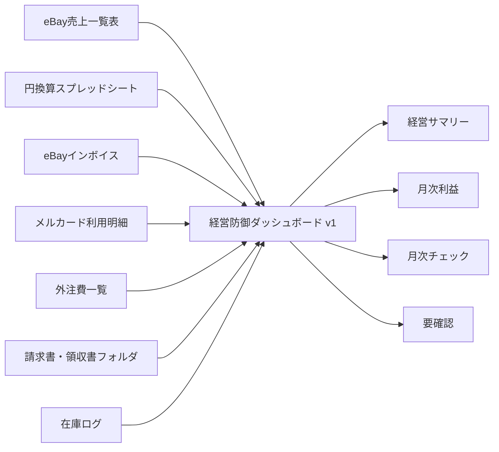

# 経営防御ダッシュボード v1 仕様

作成日: 2026-05-26

## 結論

最初に作るべきものは、Google Sheets版の「経営防御ダッシュボード v1」。

目的は、三神さんが毎月これだけ見れば、売上、実質利益、支出、送料、関税、外注費、固定費、在庫、月次締め状態を判断できるようにすること。

Phase1の本番GASはすぐ改造しない。まずは既存の保存データを読むだけの形で、別シートまたは別タブに集計する。

## v1で答える質問

| 質問 | 見る場所 |
|---|---|
| 今月、本当に利益が残っているか | `経営サマリー` / `月次利益` |
| 利益を削っている一番大きい原因は何か | `月次利益` |
| 送料・関税・eBay手数料が重すぎないか | `月次利益` / `eBay費用` |
| 固定費やサブスクで削れるものはあるか | `支出サブスク` |
| どの商品カテゴリを伸ばす/止めるべきか | `商品カテゴリ別` |
| 月次締めに必要なデータは揃っているか | `データ取込状況` / `月次チェック` |
| どのファイルが迷子になっているか | `要確認` |

## 画面構成

| シート名 | 役割 | 優先 |
|---|---|---|
| `経営サマリー` | 今月の売上、実質利益、利益率、要注意だけを見る | 高 |
| `月次利益` | 売上から費用を引いて、月ごとの実質利益を見る | 高 |
| `データ取込状況` | eBay、請求書、領収書、外注費、在庫ログが揃っているか見る | 高 |
| `支出サブスク` | 固定費、サブスク、カード明細を棚卸しする | 高 |
| `商品カテゴリ別` | ゲーム機、無線機、ブランド品、カーパーツ等の採算を見る | 中 |
| `eBay費用` | eBay手数料、広告費、請求額、円換算を見る | 中 |
| `要確認` | 未分類ファイル、未反映データ、判断待ちをまとめる | 高 |
| `月次チェック` | 7日、11日、15日、月末に見る項目を並べる | 高 |
| `設定` | データ元、カテゴリ、状態ラベルを管理する | 中 |

## 経営サマリー

| 項目 | 表示内容 |
|---|---|
| 今月売上 | eBay売上の円換算合計 |
| 今月実質利益 | 売上から主要費用を引いた金額 |
| 利益率 | 実質利益 ÷ 売上 |
| 今月の最大コスト | 送料、関税、手数料、外注費、固定費の最大項目 |
| 要確認件数 | 未分類、未反映、手入力待ちの件数 |
| 月次締め状態 | 緑: 締め可能 / 黄: 確認あり / 赤: 不足あり |

## 月次利益

| 月 | 売上 | 仕入原価 | eBay費用 | 送料 | 関税 | 外注費 | 固定費 | 調整 | 実質利益 | 利益率 | 状態 |
|---|---:|---:|---:|---:|---:|---:|---:|---:|---:|---:|---|

基本式:

```text
実質利益 = 売上 - 仕入原価 - eBay費用 - 送料 - 関税 - 外注費 - 固定費 + 調整
利益率 = 実質利益 / 売上
```

状態:

| 状態 | 意味 |
|---|---|
| `暫定` | 主要データの一部が未反映 |
| `要確認` | 迷子ファイル、未分類、手入力待ちがある |
| `締め可` | 月次判断に使える状態 |

## データ元

| データ元 | 使う数字 | 現在の確認状況 | v1での扱い |
|---|---|---|---|
| eBay売上一覧表 | 売上、販売件数、商品情報 | 候補確認済み。列構成は未確定 | 読み取り参照 |
| 円換算スプレッドシート | 円建て売上、為替 | 候補確認済み。列構成は未確定 | 読み取り参照 |
| eBayインボイス | 手数料、広告費、請求額 | フォルダ構造確認済み | 月次費用へ集計 |
| メルカード利用明細 | 固定費、サブスク、仕入候補 | スクショ/明細系の保存経路を確認 | 支出分類へ集計 |
| 外注費一覧 | 外注費 | 候補確認済み。個人情報は保存しない | 月合計のみ使う |
| `01_請求書メール` | 請求書添付 | 年フォルダ表記混在を確認 | 固定費根拠として使う |
| `04_税理士提出用` | 領収書、請求書、提出書類 | 月別/要確認/投げ込み構造を確認 | 月次締め状態に使う |
| 在庫ログ | 仕入原価、在庫、滞留 | 候補確認済み。列構成は未確定 | 仕入原価と在庫額へ接続 |

## データ取込状況

| 月 | eBay売上 | 円換算 | eBayインボイス | 請求書 | 領収書 | メルカード | 外注費 | 在庫ログ | 要確認 | 締め状態 |
|---|---|---|---|---|---|---|---|---|---:|---|

判定:

| 表示 | 意味 |
|---|---|
| `済` | その月のデータがある |
| `未` | データが見つからない |
| `要確認` | データはあるが分類や月が怪しい |
| `対象外` | その月は使わない |

## 要確認

| 種別 | 件数 | 主な月 | 理由 | 次アクション |
|---|---:|---|---|---|
| 未分類ファイル | 50 | 2022年、2024年、2025年、2026年 | `00_要確認` に残っている | 移動予定リストを作る |
| 年フォルダ表記混在 | あり | 2026年 | `2026` と `2026年` が混在 | 正式表記を決める |
| メール装飾画像 | あり | 2025年/2026年候補 | 税務根拠ではない可能性 | 除外ルールを作る |
| Script Properties | 未確認 | 全体 | 値露出リスク | キー名だけ確認するか判断 |

## 全体図



## 実装順

1. 既存データ元の列名を読み取り確認する。
2. 別シートで `設定`、`月次利益`、`データ取込状況` を先に作る。
3. 数字が足りない箇所は `要確認` に出す。
4. Phase1本番GASは変更せず、参照だけで集計する。
5. 三神さん確認後、必要な部分だけメニュー/ボタン化する。

## 実装前に決めること

| 決めること | 推奨 |
|---|---|
| 作る場所 | 既存本番シートを直接改造せず、別タブまたは別スプレッドシート |
| 最初の対象月 | 直近の2026年04月、2026年05月 |
| 個人情報の扱い | 月合計・分類名だけ。個人名や識別番号は保存しない |
| 不足データ | 手入力補正欄を作り、あとで自動化 |
| Phase1本番GAS | v1では変更しない |

## 未完了

- eBay売上一覧表、円換算、外注費、在庫ログの実列名確認。
- 最新月データの有無確認。
- 関税実績の保存場所確認。
- 商品別仕入原価の接続方法確認。
- ダッシュボード実体の作成。
