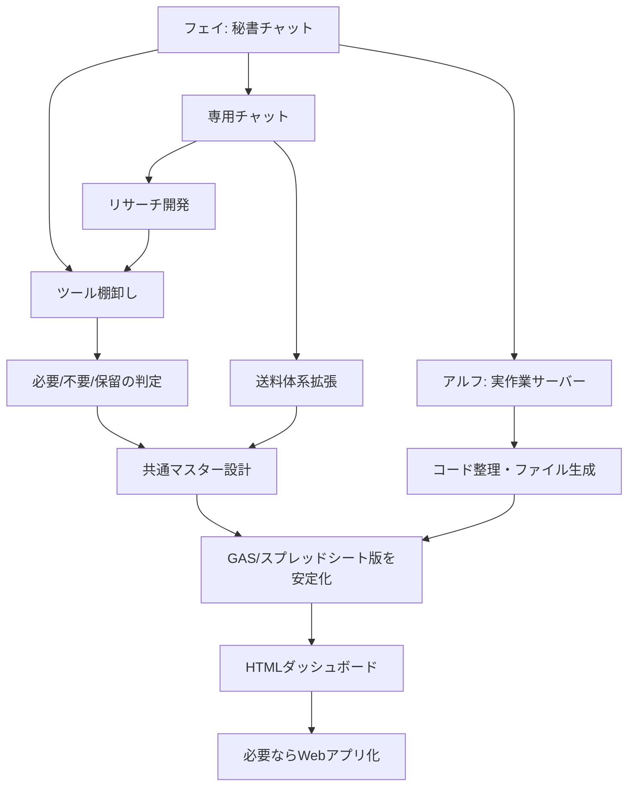

# 業務ツール再構築プラン

最終更新: 2026-05-23

## 結論

いきなりWebアプリ化せず、まずは既存ツール群の棚卸しと機能統合を行う。

推奨順序:

1. 棚卸し
2. 重複整理
3. 必要機能の確定
4. スプレッドシート/GAS版の安定運用
5. 共通マスター化
6. Webアプリ化判断

## なぜすぐWebアプリ化しないか

現時点では、機能の重複・未整理・未確定部分が多い。

この状態でWebアプリ化すると:

- 不要機能まで作り込む
- 設計が肥大化する
- 使わない機能の保守が発生する
- 送料体系やリサーチロジックの変更に弱くなる

まず「何を作るべきか」を確定する方が重要。

## 目標構成

### Phase 1: 既存資産の整理

- ツール一覧化
- GAS一覧化
- スプレッドシート一覧化
- チャット別成果物一覧化
- 必要/不要/保留の判定

### Phase 2: 共通マスター化

共通化するもの:

- キャリアマスター
- 送料表マスター
- ゾーン定義
- シッピングポリシーマスター
- 為替マスター
- サーチャージマスター
- カテゴリマスター
- 過去出荷データ

現在の優先共通マスター:

1. 送料表マスター v2.0
2. キャリアマスター
3. ゾーン定義
4. サーチャージマスター
5. ポリシーマスター

理由:

- リサーチサポートツールの利益計算が簡易送料のままだと精度が低い
- 料金改定時に複数ツールを修正するのは運用負荷が高い
- 共通マスターを1つ更新すれば、リサーチ・既存出品管理・Sellsta CSV生成へ反映できる構造にしたい

### Phase 3: ツール再構築

残すべき主要ツール:

1. リサーチ支援ツール
2. 既存出品ポリシー変更ツール
3. Sellsta CSV生成/編集ツール
4. 送料・利益計算エンジン
5. 過去データ分析/ベンチマーク

### Phase 4: ダッシュボード化

Webアプリ化する場合の役割:

- ツール一覧
- プロジェクト一覧
- 現在の進捗
- 各スプレッドシートへのリンク
- 各チャット/担当へのリンク
- 成果物一覧
- 未完了タスク
- エラー/確認待ち一覧

## Webアプリ化の選択肢

### 案A: まずGoogle Sheets + HTMLダッシュボード

内容:

- Markdown/CSV/Google Sheetsを正本にする
- HTMLダッシュボードを生成する
- GitHubやDriveで閲覧する

メリット:

- 低コスト
- 早い
- データを壊しにくい
- AIが保守しやすい

デメリット:

- 本格Webアプリほど操作性は高くない

推奨度: 高

### 案B: Google Sheets + Apps Script Web App

内容:

- GASでWeb画面を作る
- スプレッドシートをデータベース代わりにする

メリット:

- 既存資産と相性が良い
- Googleアカウントで運用しやすい

デメリット:

- UIや速度に限界
- GAS制限がある

推奨度: 中

### 案C: Next.js + Supabase

内容:

- 本格Webアプリとして作る
- DBにツール台帳・料金表・タスクを管理

メリット:

- 長期運用に強い
- UIを作り込める
- 複数人運用に向く

デメリット:

- 初期構築が重い
- 設計が固まる前にやると危険

推奨度: 将来候補

### 案D: Manus / Lovable / Cursor

内容:

- AI開発ツールでプロトタイプを作る

メリット:

- 速い
- 画面を試しやすい

デメリット:

- 本番運用・データ所有・継続保守に注意

推奨度: 試作向き

## 推奨

現時点では、案Aから始める。

理由:

- 今は「作る」より「整理する」段階
- Markdown/GitHub/Google Sheetsで十分に管理可能
- 必要機能が固まった後にWebアプリ化すれば失敗しにくい

## 可視化イメージ

## 次アクション

1. 追加の別チャット履歴を受け取る。
2. `tool-inventory.md` を更新する。
3. 既存GAS/スプシ/CSV/チャットを機能別に分類する。
4. 「残す」「統合」「保留」「廃止候補」に分ける。
5. 最小ダッシュボード案を作る。

## 2026-05-23 時点の実行優先順位

### 最優先

マスター送料体系 v2.0 をマスタースプレッドシートへ反映し、`FIND_CHEAPEST_CARRIER()` が使える状態にする。

理由:

- リサーチサポートツール統合の前提になる
- 既存出品管理の送料・ポリシー判断にも関係する
- ダッシュボード化する前に、共通マスターの正本を固める必要がある

### 次点

リサーチサポートツール側で、簡易送料テーブルを廃止し、マスター送料体系 v2.0 を参照する。

### その後

ツール群管理ダッシュボードを作る。

最初は本格Webアプリではなく、以下の構成を推奨:

- `tool-inventory.md`
- `delegated-tasks.md`
- Google Sheetsのリンク集
- HTMLダッシュボード

本格Webアプリ化は、共通マスター・リサーチ統合・既存出品管理が安定してから判断する。
